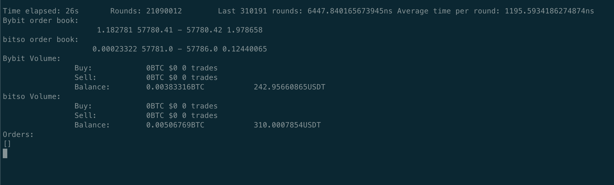

# Mock crypto trading bot

This repo implements a mock crypto trading bot. The main strategy implemented is a simple arbitrage strategy between Bybit and Gate.io exchanges. The bot is implemented in Python and uses the ccxt library to interact with the exchanges. It's written in a modular way so that it can be easily extended to other exchanges or strategies. The modules make use of classes, threads and asyncio to handle the asynchronous nature of the exchanges and maintain the bot's ability to make decisions in real-time.

The default python interpreter was also replaced with pypy in order to improve performance.

The average latency of the main execution loop varies between 0.5 and 1.5 ms (since no orders are being placed). With the order execution implemented, the execution loop time generally stays between 5-10ms.

## Running the bot

First, build the docker container:

```bash
docker buildx build -t mock-crypto-trading-bot .
```

Then, you can run it:

```bash
docker run -it \
-e BYBIT_API_KEY="YOUR_API_KEY" \
-e BYBIT_API_SECRET="YOU_API_SECRET" \
-e GATE_API_KEY="YOUR_API_KEY" \
-e GATE_API_SECRET="YOUR_API_SECRET" \
mock-crypto-trading-bot
```

You can see an example of the output here:


